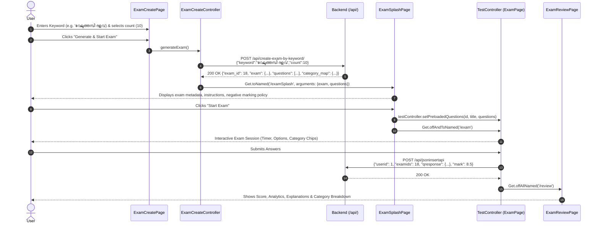
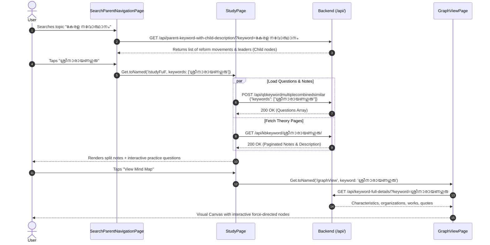

# PSC Exam App: Complete API & Navigation Documentation

This document provides comprehensive technical documentation for the PSC Exam Flutter application. It covers:
1. **Dynamic Navigation Architecture** (How backend tree nodes trigger frontend routes)
2. **Master API & Navigation Mapping Table** (Route, Navigation Key, API Endpoint, Method, Payload, Purpose, Target Page)
3. **End-to-End Visual Flowcharts (Mermaid Diagrams)**
4. **Concrete API Request & Response Examples**
5. **UI Screen Layout / Wireframe Previews**

---

## 1. Dynamic Architecture Overview

The app is **data-driven and hierarchical**. Rather than static hardcoded menus, the main structure is fetched dynamically on startup from the **Hierarchy Engine** (`/api/nodeall/`).

```
                              ┌────────────────────────────────┐
                              │  Backend: /api/nodeall/ Tree   │
                              └───────────────┬────────────────┘
                                              │
                       ┌──────────────────────┴──────────────────────┐
                       ▼                                             ▼
             [Parent Node (Group)]                         [Action / Leaf Node]
             - Children present                            - Has 'navigation' key
             - Has 'orientation'                           - Has 'url' endpoint
             - Renders DynamicMenu / Slide                 - Has 'keywords' list
                       │                                             │
                       └──────────────────────┬──────────────────────┘
                                              │
                                              ▼
                             ┌────────────────────────────────┐
                             │ Navigation Dispatcher          │
                             │ (HomeController, DynamicMenu,  │
                             │  ExamMenuController, etc.)     │
                             └───────────────┬────────────────┘
                                              │
        ┌─────────────┬─────────────┬────────┴────┬─────────────┬─────────────┐
        ▼             ▼             ▼             ▼             ▼             ▼
   /examcreate    /timeline   /studyFull     /examSplash   /graphView   /keywordSummary
```

### Core Hierarchy Node Model (`nodeall`)
```json
{
  "id": 74,
  "name": "Exam",
  "parent": 46,
  "navigation": "examcreate",
  "url": "create-exam-by-keyword",
  "orientation": "horizontal",
  "keywords": ["കേരളം"],
  "access_type": "free",
  "children": []
}
```

- **`navigation`**: Specifies the frontend action/route handler (`examcreate`, `timeline`, `studyFull`, `dynamicExamList`, `searchParentNavigation`, `navigationSlide`, etc.).
- **`url`**: Optional sub-endpoint or custom path for the API call.
- **`keywords`**: Array of topic tags in Malayalam or English passed into the destination controller.
- **`orientation`**: Defines UI layout mode for parent groups:
  - `horizontal`: Horizontal scrolling category chips.
  - `collapse`: Expandable accordion container.
  - `fixed`: Standard vertical grid / list.
- **`access_type`**: Checked by `AuthController.canAccess()` (`free` vs `paid` plans).

---

## 2. Master Navigation & API Mapping Table

| Frontend Route (`GetPage`) | Backend `navigation` Key | Associated API Endpoint | HTTP Method | Input / Arguments | Target Controller & View | Purpose & User Experience |
| :--- | :--- | :--- | :---: | :--- | :--- | :--- |
| **`/splash`** | `initialRoute` | `/api/active-knowledge-scroll/`<br>`/api/active-advertisements/` | `GET` | None | `SplashPage`<br>`KnowledgeCapsuleController`<br>`AdController` | App startup, token check, preloads initial popup ads & daily study fact. |
| **`/home`** | Home Tabs | `/api/nodeall/`<br>`/api/get-images-by-category/`<br>`/api/active-notifications/` | `GET`<br>`POST`<br>`GET` | Category: `"slide"` for banner slider | `HomePage`<br>`HomeController`<br>`ImageSliderController` | Main dashboard: banner slider, dynamic tree nodes, exam categories, and news ticker. |
| **`/examcreate`** | `examcreate`<br>`/examcreate` | `/api/create-exam-by-keyword/` | `POST` | `{"keyword": String, "count": int}` | `ExamCreateController`<br>`ExamCreatePage` | **AI Exam Generator**: User selects/types a keyword and question count; backend generates an instant exam. |
| **`/examSplash`** | `examSplash`<br>`/examSplash` | `/api/testexam/{examId}/` | `GET` | `examId` (int) | `TestController`<br>`ExamSplashPage` | Pre-exam instructions, duration, negative marks, total questions, and "Start Exam" button. |
| **`/exam`** | Exam Runner | Internal state or `/api/testexam/{examId}/` | `GET` | Preloaded questions or `examId` | `TestController`<br>`ExamPage` | Interactive test session: timer countdown, Malayalam/English questions, category filter chips, option selection, palette drawer. |
| **`/review`** | Post Exam | `/api/jsoninsertapi`<br>`/api/getresultapi` | `POST` | `{"userid": id, "examids": id, "qresponse": snap, "mark": mark, "time_taken": {...}}` | `TestController`<br>`ExamReviewPage` | Answer review, detailed solution explanations, score calculation, correct vs wrong breakdown. |
| **`/timeline`** | `timeline`<br>`/timeline` | `/api/keywordtimeline/{keyword}/` | `GET` | `keyword` (URL encoded) | `TimelineController`<br>`TimelinePage` | Interactive chronological timeline grouped by year for historical events, acts, reforms. |
| **`/studyFull`** | `studyFull`<br>`/studyFull` | 1. `/api/qbkeywordmultiplecombinedsimilar`<br>2. `/api/kbkeyword/{keyword}/` | `POST`<br>`GET` | 1. `{"keywords": [kw1, kw2]}`<br>2. Path param `{keyword}` | `StudyController`<br>`StudyPage` | Topic study material: split paginated theory descriptions + associated multiple-choice practice questions. |
| **`/story`** | `story`<br>`/story` | `/api/kbkeyword/{keyword}/` | `GET` | `keyword` (URL encoded) | `StoryController`<br>`StoryPage` | Social-media (Instagram/WhatsApp) story format for rapid bite-sized reading with progress bars. |
| **`/searchParentNavigation`** | `searchParentNavigation` | `/api/parent-keyword-with-child-description/?keyword={kw}` | `GET` | `keyword` query param | `SearchParentNavigationController`<br>`SearchParentNavigationPage` | Search bar + tree explorer to find subtopics and parent-child topic hierarchies. |
| **`/parentNavigation`** | `parentNavigation` | `/api/parent-keyword-with-child-description/?keyword={kw}` | `GET` | `keyword` query param | `ParentNavigationController`<br>`ParentNavigationPage` | Displays direct subtopics under a selected parent topic. |
| **`/graphView`** | `graphView` | `/api/keyword-full-details/?keyword={kw}`<br>`/api/qbkeywordcharacteristic/{kw}` | `GET` | `keyword` query param | `KeywordDetailsController`<br>`GraphViewPage` | **Mind Map Visualizer**: Node-link graph connecting central keyword to characteristic branches. |
| **`/keywordSummary`** | `keywordSummary`<br>`summary` | `/api/keyword-search-summary/?keyword={kw}` | `GET` | `keyword` query param | `KeywordSummaryController`<br>`KeywordSummaryPage` | Bulleted revision summary or related child keyword suggestions for fast revision. |
| **`/knowledgeCapsule`** | `knowledgeCapsule` | `/api/keyword-summary-knowledge-capsule/` | `GET` | None | `KeywordSummaryCapsuleController`<br>`KeywordSummaryKnowledgeCapsulePage` | High-yield fact cards / flashcards with quick flip/expand cards. |
| **`/characteristic`** | `characteristic` | `/api/qbkeywordcharacteristic/{kw}` | `GET` | `keyword` path param | `CharacteristicController`<br>`CharacteristicPage` | Questions classified by historical/thematic characteristics. |
| **`/studySearch`** | `studySearch` | `/api/qbkeywordmultiplecombinedsimilar`<br>`/api/kbkeyword/{keyword}/` | `POST`<br>`GET` | Query text (Malayalam or English) | `StudySearchController`<br>`StudySearchPage` | Universal study search with instant question matching and auto-suggestions. |
| **`/keywordSearch`** | `keywordSearch` | `/api/qbkeywordmultiplecombinedsimilar-with-keyword` | `POST` | `{"keywords": [selectedKws]}` | `KeywordSearchController`<br>`KeywordSearchPage` | Tag/Hashtag-based question search with dynamic pill filters. |
| **`/dynamicExamList`** | `dynamicExamList` | `/api/{endpoint}` (e.g. `activeexams/booster`) | `GET` | `endpoint` from node | `ExamListPageDynamic` | Curated lists of exams (e.g. Rank Booster, Live Exams, Model Exams). |
| **`/navigationSlide`** | `navigationSlide` | Uses nested `children` array | Local | `children` nodes | `NavigationSlideController`<br>`NavigationSlidePage` | Carousel slide explorer through multiple sub-categories. |
| **`/login`** | Authentication | `/api/get_userdetails_by_username/{email}/`<br>`/api/save_fcm_token/` | `GET`<br>`POST` | Google Sign-in token + FCM token | `AuthController`<br>`LoginPage` | Google OAuth authentication, profile sync, plan subscription check, and device push token registration. |
| **`/newsfeeder`** | `newsfeeder` | Node `url` (e.g. custom news feed endpoint) | `GET` | Custom endpoint | `NewsController`<br>`NewsFeederPage` | Real-time PSC notifications, exam calendar announcements, and syllabus updates. |

---

## 3. End-to-End Flowcharts

### A. High-Level User Journey
```mermaid
flowchart TD
    Start([App Launch]) --> Splash[/splash]
    Splash -->|Preload Ads & Knowledge Fact| Home[/home: Tab 0 / 1 / 2]
    
    subgraph Home_Navigation ["Home Dynamic Navigation Tree (/api/nodeall/)"]
        Home -->|Tap Node| CheckNav{Node Navigation Type?}
        
        CheckNav -->|examcreate| ExamCreate[/examcreate]
        CheckNav -->|timeline| Timeline[/timeline]
        CheckNav -->|studyFull| Study[/studyFull]
        CheckNav -->|searchParentNavigation| SearchParent[/searchParentNavigation]
        CheckNav -->|keywordSummary| Summary[/keywordSummary]
        CheckNav -->|graphView| Graph[/graphView]
        CheckNav -->|story| Story[/story]
        CheckNav -->|dynamicExamList| ExamList[/dynamicExamList]
    end

    ExamCreate -->|Generate Exam via API| SplashExam[/examSplash]
    ExamList -->|Select Exam| SplashExam
    SplashExam -->|Start Test| ExamSession[/exam]
    ExamSession -->|Submit Test / Timer Expired| Review[/review]
```

---

### B. AI Exam Generation & Exam Taking Flow


---

### C. Dynamic Study & Topic Exploration Flow


---

## 4. API Request & Response Samples

### 1. Create Exam by Keyword
- **Endpoint**: `POST /api/create-exam-by-keyword/`
- **Headers**: `Content-Type: application/json`
- **Request Body**:
```json
{
  "keyword": "kerala",
  "count": 5
}
```
- **Response (200 OK)**:
```json
{
  "status": "success",
  "message": "Exam created successfully",
  "exam_id": 16,
  "category": "kerala",
  "type": "mock",
  "keyword": "kerala",
  "question_count": 5,
  "total_available_questions": 224,
  "qid": [478, 144, 712, 714, 386],
  "exam": {
    "id": 16,
    "category": "kerala",
    "specialization": "Exam: kerala",
    "type": "mock",
    "qid": [478, 144, 712, 714, 386],
    "category_map": "{'പൊതുവിജ്ഞാനം': [478, 144, 386], 'കല': [712, 714]}",
    "active": true,
    "locked": false,
    "access_type": "free",
    "instructions": "Exam generated for keyword: kerala",
    "description": "Exam covering keyword 'kerala' with 5 questions.",
    "plans": [],
    "plan_ids": [],
    "is_locked": false
  },
  "questions": [
    {
      "id": 478,
      "question": "മലയാളത്തിലെ ആദ്യ സിനിമ സംവിധാനം ചെയ്തത് ആരാണ്?",
      "option1": "ജെ.സി. ഡാനിയേൽ",
      "option2": "പി.ഭാസ്കരൻ",
      "option3": "റാമു കാര്യാട്ട്",
      "option4": "അടൂർ ഗോപാലകൃഷ്ണൻ",
      "answer": "ജെ.സി. ഡാനിയേൽ",
      "description": "മലയാളത്തിലെ ആദ്യ സിനിമയായ 'വിഗതകുമാരൻ' സംവിധാനം ചെയ്തത് ജെ.സി. ഡാനിയേൽ ആണ്.",
      "category": "പൊതുവിജ്ഞാനം"
    }
  ]
}
```

---

### 2. Chronological Timeline
- **Endpoint**: `GET /api/keywordtimeline/{keyword}/`
- **Sample URL**: `/api/keywordtimeline/കേരള സമരങ്ങൾ/`
- **Response (200 OK)**:
```json
[
  {
    "year": 1809,
    "events": [
      {
        "id": 12,
        "title": "കുണ്ടറ വിളംബരം",
        "description": "വേലുത്തമ്പി ദളവ ബ്രിട്ടീഷുകാർക്കെതിരെ പോരാടാൻ ആഹ്വാനം ചെയ്തു.",
        "date": "1809-01-11"
      }
    ]
  },
  {
    "year": 1924,
    "events": [
      {
        "id": 45,
        "title": "വൈക്കം സത്യാഗ്രഹം",
        "description": "ക്ഷേത്രറോഡുകളിലൂടെ അവർണ്ണർക്ക് നടക്കാനുള്ള അവകാശത്തിനായി സമരം ആരംഭിച്ചു.",
        "date": "1924-03-30"
      }
    ]
  }
]
```

---

### 3. Parent-Child Topic Navigation
- **Endpoint**: `GET /api/parent-keyword-with-child-description/?keyword={keyword}`
- **Sample URL**: `/api/parent-keyword-with-child-description/?keyword=കേരളം`
- **Response (200 OK)**:
```json
{
  "parent": "കേരളം",
  "children": [
    {
      "id": 101,
      "name": "നദികൾ",
      "navigation": "studyFull",
      "keywords": ["കേരളത്തിലെ നദികൾ"],
      "orientation": "horizontal"
    },
    {
      "id": 102,
      "name": "ചരിത്രം",
      "navigation": "timeline",
      "keywords": ["കേരള ചരിത്രം"],
      "orientation": "horizontal"
    },
    {
      "id": 103,
      "name": "പരീക്ഷ",
      "navigation": "examcreate",
      "keywords": ["കേരളം"],
      "orientation": "horizontal"
    }
  ]
}
```

---

### 4. Topic Study Questions
- **Endpoint**: `POST /api/qbkeywordmultiplecombinedsimilar`
- **Headers**: `Content-Type: application/json`
- **Request Body**:
```json
{
  "keywords": ["പെരിയാർ", "ചാലക്കുടിപ്പുഴ"]
}
```
- **Response (200 OK)**:
```json
[
  {
    "id": 204,
    "question": "കേരളത്തിലെ ഏറ്റവും നീളം കൂടിയ നദി ഏത്?",
    "option1": "ഭാരതപ്പുഴ",
    "option2": "പെരിയാർ",
    "option3": "പമ്പ",
    "option4": "ചാലിയാർ",
    "answer": "പെരിയാർ",
    "description": "പെരിയാറിന്റെ നീളം 244 കി.മീറ്റർ ആണ്."
  }
]
```

---

### 5. Exam Result Submission
- **Endpoint**: `POST /api/jsoninsertapi`
- **Headers**: `Content-Type: application/json`
- **Request Body**:
```json
{
  "userid": 12,
  "examids": 16,
  "qresponse": {
    "478": {"selected": "ജെ.സി. ഡാനിയേൽ", "is_correct": true, "time_spent": 14},
    "144": {"selected": "പി.ഭാസ്കരൻ", "is_correct": false, "time_spent": 22}
  },
  "mark": 0.67,
  "time_taken": {
    "Total": 36,
    "പൊതുവിജ്ഞാനം": 36
  }
}
```

---

## 5. Screen Layout & Wireframe Previews

### A. AI Exam Generator (`/examcreate`)
```
+-------------------------------------------------------------+
|  <-  Generate Custom Exam                                  |
+-------------------------------------------------------------+
|                                                             |
|   [ Sparkle Icon ]  Instant Exam Generator                  |
|   Select topic keyword and question count to build exam.    |
|                                                             |
|   Topic or Keyword                                          |
|   +-----------------------------------------------------+   |
|   |  വേലുത്തമ്പി ദളവ                                 [X] |   |
|   +-----------------------------------------------------+   |
|                                                             |
|   Suggested Topics:                                         |
|   [ കേരളം ]  [ നവോത്ഥാനം ]  [ പെരിയാർ ]  [ ഭരണഘടന ]       |
|                                                             |
|   Number of Questions:                                      |
|   [  -  ]                 [  15  ]                 [  +  ]  |
|                                                             |
|   Quick Selection:                                          |
|   ( 5 )     ( 10 )    *( 15 )*    ( 25 )    ( 50 )          |
|                                                             |
|   Estimated Time: 15 mins   |   Negative Marking: 0.33      |
|                                                             |
|   +-----------------------------------------------------+   |
|   |          [🚀 Generate & Start Exam]                 |   |
|   +-----------------------------------------------------+   |
+-------------------------------------------------------------+
```

---

### B. Interactive Exam Session (`/exam`)
```
+-------------------------------------------------------------+
|  <-  Exam Title                      ⏱️ 14:32  [ Palette ≡ ] |
+-------------------------------------------------------------+
|  [ *All* ]  [ GK ]  [ History ]  [ Science ]  [ Malayalam ] |
+-------------------------------------------------------------+
|                                                             |
|  Question 4 of 15                             [ Bookmark 🔖] |
|                                                             |
|  മലയാളത്തിലെ ആദ്യ സിനിമ സംവിധാനം ചെയ്തത് ആരാണ്?               |
|                                                             |
|  ( )  A.  ജെ.സി. ഡാനിയേൽ                                    |
|  (*)  B.  പി.ഭാസ്കരൻ                                        |
|  ( )  C.  റാമു കാര്യാട്ട്                                    |
|  ( )  D.  അടൂർ ഗോപാലകൃഷ്ണൻ                                  |
|                                                             |
+-------------------------------------------------------------+
|  [ < Previous ]       [ Mark & Next ]        [ Next > ]     |
|                       [ SUBMIT TEST ]                       |
+-------------------------------------------------------------+
```

---

### C. Historical Timeline View (`/timeline`)
```
+-------------------------------------------------------------+
|  <-  Timeline: കേരള സമരങ്ങൾ                                |
+-------------------------------------------------------------+
|  [ 🔍 Search timeline events...                        ]   |
+-------------------------------------------------------------+
|                                                             |
|     1809  ●─── [ കുണ്ടറ വിളംബരം ]                           |
|           │    വേലുത്തമ്പി ദളവ ബ്രിട്ടീഷുകാർക്കെതിരെ      |
|           │    പോരാടാൻ കുണ്ടറയിൽ വെച്ച് ആഹ്വാനം ചെയ്തു.   |
|           │                                                 |
|     1859  ●─── [ ചാന്നാർ ലഹള ]                              |
|           │    മാറു മറയ്ക്കാനുള്ള അവകാശത്തിനായി നടന്ന സമരം. |
|           │                                                 |
|     1924  ●─── [ വൈക്കം സത്യാഗ്രഹം ]                        |
|           │    ക്ഷേത്രറോഡുകളിലൂടെ അവർണ്ണർക്ക് സഞ്ചാര        |
|           │    സ്വാതന്ത്ര്യത്തിനായി ആരംഭിച്ച സത്യാഗ്രഹം.     |
|           │                                                 |
|     1931  ●─── [ ഗുരുവായൂർ സത്യാഗ്രഹം ]                     |
|                കെ. കേളപ്പന്റെ നേതൃത്വത്തിൽ നടന്ന സമരം.      |
|                                                             |
+-------------------------------------------------------------+
```

---

### D. Study Page: Paginated Theory + Question Practice (`/studyFull`)
```
+-------------------------------------------------------------+
|  <-  ശ്രീനാരായണഗുരു                     [ MindMap 🕸️ ] [ Story 📖 ] |
+-------------------------------------------------------------+
|  [ 📖 Study Notes (Page 1 of 3) ]                           |
|  ശ്രീനാരായണഗുരു (1856 - 1928) കേരളത്തിലെ പ്രമുഖ നവോത്ഥാന    |
|  നായകനും സാമൂഹിക പരിഷ്കർത്താവുമായിരുന്നു. "ഒരു ജാതി, ഒരു      |
|  മതം, ഒരു ദൈവം മനുഷ്യന്" എന്നത് അദ്ദേഹത്തിന്റെ ദർശനമാണ്.      |
|                                                             |
|  < Previous Page                              Next Page >   |
+-------------------------------------------------------------+
|  Practice Questions (12)                                    |
|                                                             |
|  Q1: ഗുരു അരുവിപ്പുറം പ്രതിഷ്ഠ നടത്തിയ വർഷം ഏത്?            |
|  ( ) 1888     ( ) 1887     ( ) 1898     ( ) 1890            |
|  [ Show Answer & Explanation v ]                            |
|                                                             |
|  Q2: എസ്.എൻ.ഡി.പി യോഗം സ്ഥാപിതമായ വർഷം?                    |
|  ( ) 1903     ( ) 1904     ( ) 1902     ( ) 1905            |
+-------------------------------------------------------------+
```
